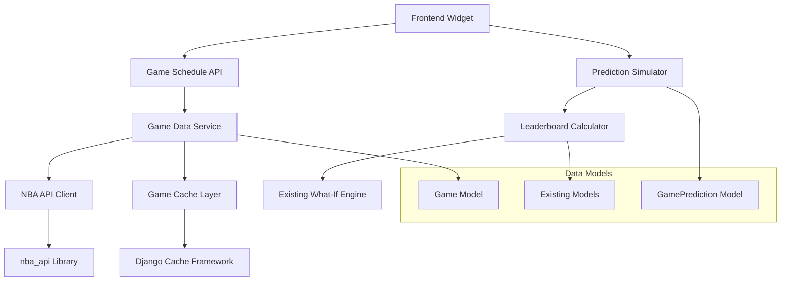

# Design Document

## Overview

The Upcoming Games Schedule feature provides a reusable, configurable widget that displays upcoming games and allows users to predict winners with real-time leaderboard impact simulation. The system is built with sport-agnostic architecture to support future expansion beyond NBA while leveraging existing patterns from the codebase.

## Architecture

### High-Level Architecture



### Component Layers

1. **Presentation Layer**: React components for game display and interaction
2. **API Layer**: Django REST endpoints for game data and predictions
3. **Service Layer**: Business logic for game fetching, caching, and simulation
4. **Data Layer**: Models for games and predictions, integrated with existing schema

## Components and Interfaces

### Frontend Components

#### 1. UpcomingGamesWidget (Enhanced)
```typescript
interface UpcomingGamesWidgetProps {
  // Configuration (set by developer)
  daysRange?: number;           // Default: 7
  sportType?: 'nba' | 'nfl';   // Default: 'nba'
  gameTypes?: GameType[];       // Default: ['regular_season']
  enablePredictions?: boolean;  // Default: false
  showImpactIndicators?: boolean; // Default: true
  
  // Styling
  className?: string;
  title?: string;
  
  // Callbacks
  onPredictionChange?: (predictions: GamePrediction[]) => void;
  onSimulate?: (results: SimulationResults) => void;
}

interface GameType {
  type: 'regular_season' | 'in_season_tournament' | 'playoffs';
  label: string;
}

interface GamePrediction {
  gameId: string;
  predictedWinner: 'home' | 'away';
  confidence?: number;
}
```

#### 2. GameCard Component
```typescript
interface GameCardProps {
  game: Game;
  prediction?: GamePrediction;
  impactLevel?: 'high' | 'medium' | 'low';
  predictionMode: boolean;
  onPredictionChange: (gameId: string, winner: 'home' | 'away') => void;
}
```

#### 3. ImpactIndicator Component
```typescript
interface ImpactIndicatorProps {
  level: 'high' | 'medium' | 'low';
  tooltip: string;
  pointsAtStake?: number;
}
```

### Backend Components

#### 1. Game Data Service
```python
class GameDataService:
    """Service for fetching and managing game schedule data"""
    
    def get_upcoming_games(
        self, 
        sport: str = 'nba',
        days: int = 7,
        game_types: List[str] = None
    ) -> List[Game]:
        """Fetch upcoming games with caching"""
        
    def refresh_game_data(self, sport: str) -> None:
        """Force refresh of game data from API"""
        
    def get_game_impact_analysis(
        self, 
        user_id: int, 
        games: List[Game]
    ) -> Dict[str, ImpactAnalysis]:
        """Analyze potential impact of games on user predictions"""
```

#### 2. NBA API Client
```python
class NBAAPIClient:
    """Client for nba_api integration following existing patterns"""
    
    def get_schedule(
        self, 
        start_date: datetime, 
        end_date: datetime
    ) -> List[Dict]:
        """Fetch schedule using nba_api"""
        
    def get_game_details(self, game_id: str) -> Dict:
        """Get detailed game information"""
```

#### 3. Prediction Simulator
```python
class GamePredictionSimulator:
    """Simulates leaderboard changes based on game predictions"""
    
    def simulate_game_outcomes(
        self,
        user_id: int,
        predictions: List[GamePrediction]
    ) -> SimulationResults:
        """Calculate potential leaderboard changes"""
        
    def calculate_impact_levels(
        self,
        user_id: int,
        games: List[Game]
    ) -> Dict[str, str]:
        """Determine impact level for each game"""
```

### API Endpoints

#### 1. Game Schedule Endpoints
```python
# GET /api/v2/games/upcoming/
class UpcomingGamesView(APIView):
    """Get upcoming games with optional filtering"""
    
    def get(self, request):
        # Query parameters:
        # - days: int (1-14)
        # - sport: str ('nba')
        # - game_types: str (comma-separated)
        # - include_impact: bool
        pass

# POST /api/v2/games/simulate/
class GameSimulationView(APIView):
    """Simulate leaderboard changes based on game predictions"""
    
    def post(self, request):
        # Body: { predictions: [{ gameId, predictedWinner }] }
        pass
```

#### 2. Impact Analysis Endpoint
```python
# GET /api/v2/games/{game_id}/impact/
class GameImpactView(APIView):
    """Get impact analysis for a specific game"""
    
    def get(self, request, game_id):
        # Returns impact level and explanation
        pass
```

## Data Models

### Game Model
```python
class Game(models.Model):
    """Represents a scheduled game"""
    
    # Core game information
    external_id = models.CharField(max_length=50, unique=True)  # From nba_api
    sport = models.CharField(max_length=10, default='nba')
    season = models.ForeignKey(Season, on_delete=models.CASCADE)
    
    # Teams
    home_team = models.ForeignKey(Team, on_delete=models.CASCADE, related_name='home_games')
    away_team = models.ForeignKey(Team, on_delete=models.CASCADE, related_name='away_games')
    
    # Schedule
    game_date = models.DateTimeField()
    status = models.CharField(max_length=20, default='scheduled')  # scheduled, in_progress, final
    
    # Game type classification
    game_type = models.CharField(
        max_length=30,
        choices=[
            ('regular_season', 'Regular Season'),
            ('in_season_tournament', 'In-Season Tournament'),
            ('playoffs', 'Playoffs'),
        ],
        default='regular_season'
    )
    
    # Results (when available)
    home_score = models.IntegerField(null=True, blank=True)
    away_score = models.IntegerField(null=True, blank=True)
    winner = models.CharField(max_length=4, choices=[('home', 'Home'), ('away', 'Away')], null=True, blank=True)
    
    # Metadata
    created_at = models.DateTimeField(auto_now_add=True)
    updated_at = models.DateTimeField(auto_now=True)
    
    class Meta:
        indexes = [
            models.Index(fields=['game_date', 'sport']),
            models.Index(fields=['season', 'game_type']),
        ]
```

### GamePrediction Model (Optional - for persistent storage)
```python
class GamePrediction(models.Model):
    """User predictions for game outcomes (optional persistent storage)"""
    
    user = models.ForeignKey(User, on_delete=models.CASCADE)
    game = models.ForeignKey(Game, on_delete=models.CASCADE)
    predicted_winner = models.CharField(max_length=4, choices=[('home', 'Home'), ('away', 'Away')])
    confidence = models.IntegerField(default=50, validators=[MinValueValidator(1), MaxValueValidator(100)])
    created_at = models.DateTimeField(auto_now_add=True)
    
    class Meta:
        unique_together = ['user', 'game']
```

## Error Handling

### API Error Handling
```python
class GameDataError(Exception):
    """Base exception for game data operations"""
    pass

class APIRateLimitError(GameDataError):
    """Raised when API rate limit is exceeded"""
    pass

class GameNotFoundError(GameDataError):
    """Raised when requested game is not found"""
    pass
```

### Frontend Error Handling
- Graceful degradation when API is unavailable
- Loading states for data fetching
- Error messages for failed predictions
- Fallback to cached data when possible

## Testing Strategy

### Unit Tests
1. **Game Data Service Tests**
   - Test game fetching with various parameters
   - Test caching behavior
   - Test error handling for API failures

2. **Prediction Simulator Tests**
   - Test impact calculation accuracy
   - Test simulation results consistency
   - Test edge cases (no predictions, tied games)

3. **Component Tests**
   - Test widget configuration options
   - Test prediction interaction flows
   - Test responsive behavior

### Integration Tests
1. **API Integration Tests**
   - Test nba_api integration
   - Test database operations
   - Test cache invalidation

2. **End-to-End Tests**
   - Test complete prediction flow
   - Test leaderboard impact simulation
   - Test mobile responsiveness

### Performance Tests
1. **Load Testing**
   - Test widget performance with many games
   - Test API response times
   - Test cache effectiveness

2. **Memory Testing**
   - Test for memory leaks in simulation
   - Test component cleanup

## Implementation Phases

### Phase 1: Core Infrastructure
1. Create Game model and migrations
2. Implement NBA API client using nba_api
3. Create basic game data service with caching
4. Set up API endpoints for game fetching

### Phase 2: Frontend Widget
1. Enhance existing UpcomingGamesSimulator component
2. Add configuration props and styling
3. Implement responsive design
4. Add loading and error states

### Phase 3: Prediction Simulation
1. Implement prediction simulator service
2. Integrate with existing What-If engine
3. Add impact analysis calculations
4. Create simulation API endpoints

### Phase 4: Advanced Features
1. Add impact indicators and tooltips
2. Implement prediction persistence (optional)
3. Add performance optimizations
4. Create comprehensive test suite

### Phase 5: Integration & Polish
1. Integrate widget into existing pages
2. Add monitoring and logging
3. Performance tuning
4. Documentation and examples

## Security Considerations

1. **API Security**
   - Rate limiting for game data endpoints
   - Input validation for prediction data
   - Authentication for user-specific features

2. **Data Privacy**
   - No sensitive user data in game predictions
   - Optional prediction storage with user consent
   - Secure handling of leaderboard data

3. **Performance Security**
   - Prevent abuse of simulation endpoints
   - Cache poisoning protection
   - Resource usage monitoring

## Monitoring and Observability

1. **Metrics**
   - API response times
   - Cache hit rates
   - Prediction simulation performance
   - Widget usage analytics

2. **Logging**
   - Game data fetch operations
   - Prediction simulation requests
   - Error conditions and recovery

3. **Alerting**
   - API failures or timeouts
   - Cache invalidation issues
   - Performance degradation